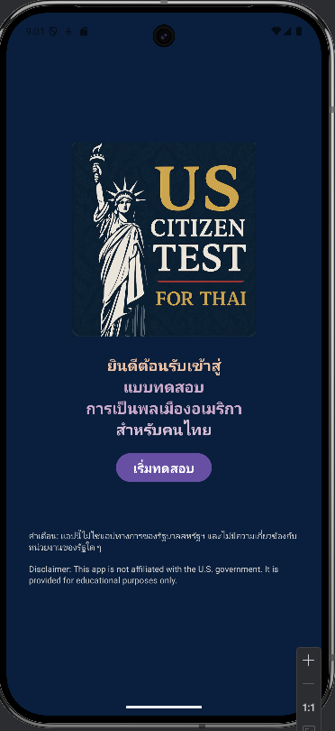
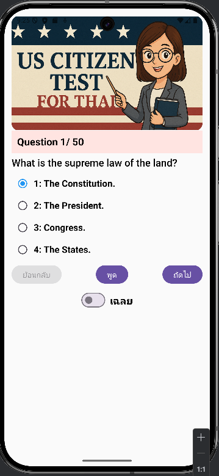
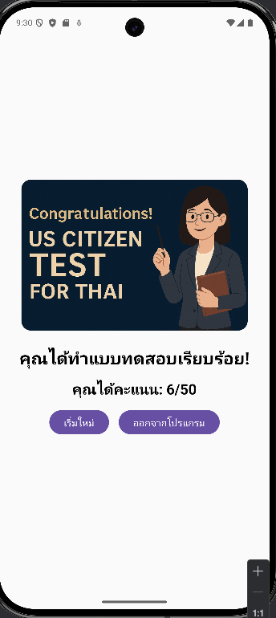

🇺🇸 US Citizen Test for Thai

A mobile Android application that helps Thai speakers prepare for the U.S. naturalization (citizenship) test with translated content, interactive quizzes, and speech support.

## 📱 Features

- ✅ 50 official USCIS questions
- 🇹🇭 Thai translations for all questions, choices, and answers
- 🔊 Text-to-Speech support for English questions and Thai explanations
- 📊 Instant scoring summary at the end of the quiz
- 👩‍🏫 Friendly UI with cartoon teacher character
- 🧠 "Show Answer" toggle for self-learning
- 🧩 Suitable for all ages preparing for the U.S. naturalization process

## 📷 Screenshots

| Home Screen | Quiz Screen | Result Screen |
|-------------|-------------|----------------|
|  |  |  |

## 🚀 How to Install

Clone the repository:

```bash
git clone https://github.com/susutchaleo/us-citizen-test-thai.git
````

Open with **Android Studio** and run the app on an emulator or physical device.

## 🛠 Tech Stack

* Kotlin
* Jetpack Compose
* Room Database
* TextToSpeech API
* Material 3 Design

## 📜 License

This project is licensed under the MIT License.

## 🙏 Credits

Developed by [susutchaleo](https://github.com/susutchaleo)
Test content based on USCIS official naturalization materials

## 🔒 Privacy

This app does not collect or store any personal information.
See => https://docs.google.com/document/d/1R_-BX26JkOLIbz5ouCmG4X_v-NiwtWYvFbGJ6Uo1Rh8/edit?usp=sharing
